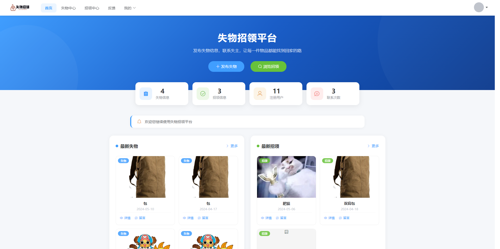
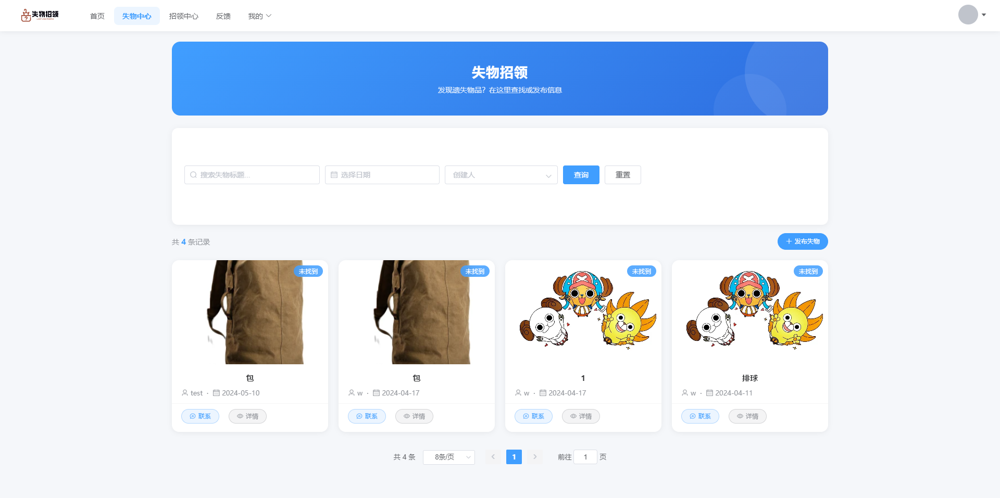
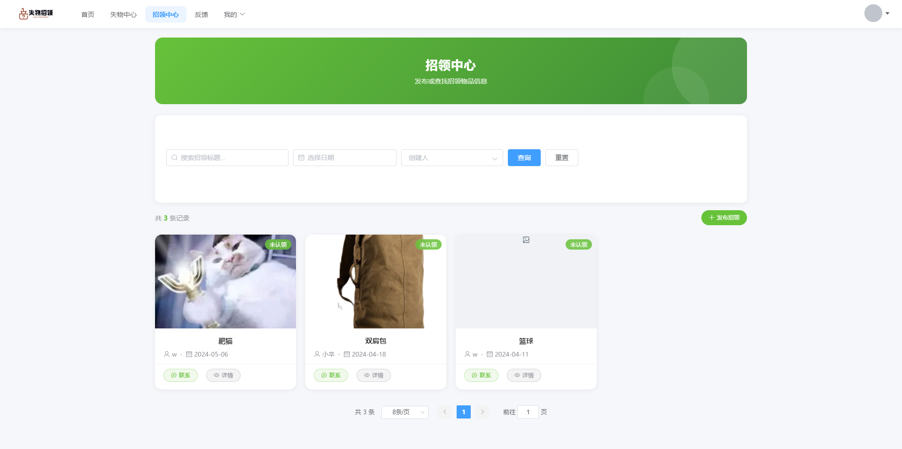
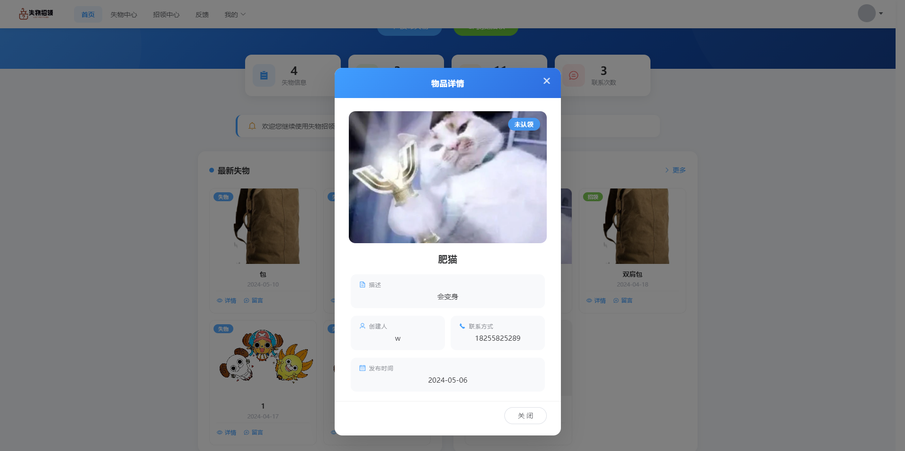
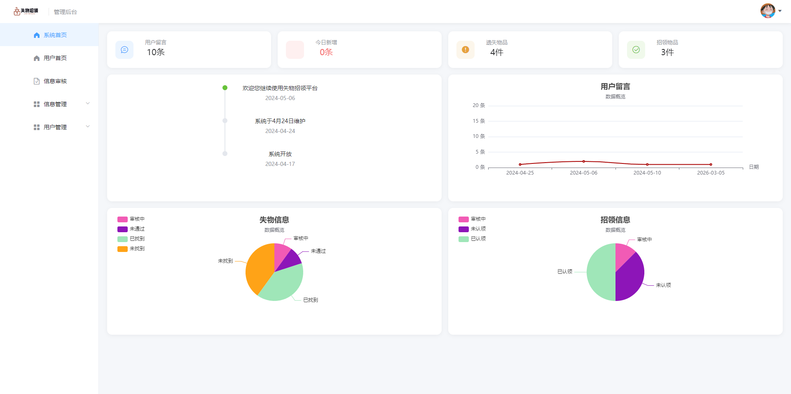

<p align="center">
  
  
  
  
</p>

<h1 align="center">🔍 失物招领平台 — 前端</h1>
<p align="center">基于 Vue 2 + Element UI 的失物招领系统前端<br/>支持 <b>用户端</b> 与 <b>管理员端</b> 双角色，覆盖失物发布、招领、留言、审核完整流程</p>

---

## ✨ 功能一览

| 角色 | 功能 |
|------|------|
| 👤 **普通用户** | 注册/登录 · 邮箱验证码 · 发布失物/招领 · 查看/搜索信息 · 在线留言 · 个人中心 · 我的发布 · 联系记录 |
| 🛡️ **管理员** | 数据仪表盘 · 公告管理 · 失物/招领审核 · 用户管理 · 反馈查看 · ECharts 可视化统计 |
| 🔒 **安全** | JWT 鉴权 · 路由守卫 · 角色权限拦截 · 请求统一拦截器 · 401/403 统一处理 |

---

## 🛠 技术栈

| 类别 | 技术 |
|------|------|
| 框架 | Vue 2.x |
| UI 库 | Element UI |
| 路由 | Vue Router (history 模式) |
| 状态管理 | Vuex |
| HTTP | Axios (统一拦截器封装) |
| 可视化 | ECharts · DataV |
| 验证码 | vue-puzzle-vcode (滑块验证) |

---

## 📁 目录结构

```
src/
├── api/            # 接口层（auth.js）
├── utils/          # 请求实例与拦截器（request.js）
├── router/         # 路由配置与鉴权守卫
├── store/          # Vuex 全局状态
├── views/          # 页面视图
│   ├── user/       #   用户端页面
│   ├── errors/     #   403/404/500 错误页
│   └── *.vue       #   管理员端 + 登录/个人中心
└── assets/         # 静态资源
```

---

## 🚀 快速开始

```bash
# 安装依赖
npm install

# 启动开发服务器（默认 http://localhost:8081）
npm run serve

# 生产构建
npm run build
```

> 后端 API 代理已配置在 `vue.config.js`，开发时自动转发 `/login` 和 `/main` 到后端 Spring Boot 服务（端口 8080）。

---

## 🔗 关联项目

- 🔙 **后端服务**：[lost_found_backend](https://github.com/asl56/lost_found_backend) — Spring Boot + MyBatis + MySQL
- 🗄️ **数据库**：`lost_found_system.sql`

---

## 📸 页面截图

| | | |
|:---:|:---:|:---:|
|  |  |  |
| **首页** | **失物中心** | **招领中心** |
|  |  |  |
| **登录注册** | **物品详情** | **管理员仪表盘** |

---

## 📄 License

MIT © TangZiJun
